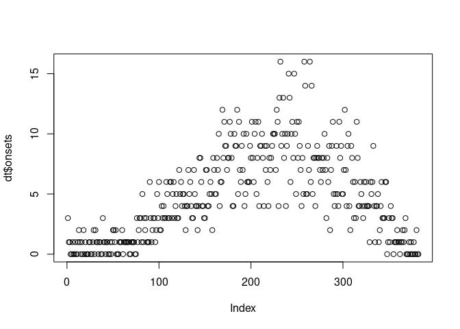

# Stan in the CMMID

> [There are many like it, but this one is
> mine](https://en.wikipedia.org/wiki/Rifleman%27s_Creed)

A short summary on the what, why, why not, and how of stan + an example
SEIR model for the CMMID computational and inference theme meeting.

## What

> Stan is a state-of-the-art platform for statistical modeling and
> high-performance statistical computation. Thousands of users rely on
> Stan for statistical modeling, data analysis, and prediction in the
> social, biological, and physical sciences, engineering, and business.
> 
> Users specify log density functions in Stan’s probabilistic
> programming language and get:
> 
>   - full Bayesian statistical inference with MCMC sampling (NUTS, HMC)
>   - approximate Bayesian inference with variational inference (ADVI)
>   - penalized maximum likelihood estimation with optimization (L-BFGS)
> 
> Stan’s math library provides differentiable probability functions &
> linear algebra (C++ autodiff). Additional R packages provide
> expression-based linear modeling, posterior visualization, and
> leave-one-out cross-validation.

See [here](https://mc-stan.org) for more.

## Why

  - Community, documention, and ongoing development.
  - A good enough tool for a broad range of problems. Useful if wanting
    to do anything other than compartmental models.
  - Clean domain-specific langauge (DSL) which can be extended with
    functions written in C++.
  - Largely automated and optimised MCMC reduces the cognitive load when
    modelling.
  - Number of stan users in the CMMID who are likely willing to help.

## Why not

  - MCMC often not a great choice for complex compartmental model
    systems. For these models tools that support PMCMC or SMC^2 are
    likely more optimal (Libbi/Birch, ODIN/Dust, etc).
  - Not likely to be widely used by many supervisors and so may be
    difficult to get code support.
  - Hard to use programmatically across models (you may find yourself
    writing a DSL generator).
  - Interaction with fit model objects is not currently ideal but this
    is an area of work in the community (and the situation is much
    better than for other tools).

## Resouces (a small selection):

  - [Bayesian workflow for disease transmission modelling in
    stan](https://mc-stan.org/users/documentation/case-studies/boarding_school_case_study.html)
  - [Fitting Bayesian models using Stan and
    R](https://www.weirdfishes.blog/blog/fitting-bayesian-models-with-stan-and-r/)
  - [Fitting a basic SIR model in
    stan](https://www.generable.com/blog/2020/04/fitting-a-basic-sir-model-in-stan/)
  - [Contemporary statistical inference for infectious disease models
    using Stan](https://arxiv.org/abs/1903.00423v3)
  - [covidseir](https://github.com/seananderson/covidseir)

## Example

### Set up

  - Load some packages

<!-- end list -->

``` r
library(rstan)
library(tidyverse)
```

  - Load the SEIR model (heavily based on [Bayesian workflow for disease
    transmission modelling in
    stan](https://mc-stan.org/users/documentation/case-studies/boarding_school_case_study.html)).

<!-- end list -->

``` r
model <- stan_model("model.stan")
model
#> S4 class stanmodel 'model' coded as follows:
#> // From: https://mc-stan.org/users/documentation/case-studies/boarding_school_case_study.html
#> // with minor adaptions
#> functions {
#>   real[] seir(real t, real[] y, real[] theta, 
#>              real[] x_r, int[] x_i) {
#> 
#>       int N = x_i[1];
#>       real tswitch = x_r[1];
#>       
#>       real beta = theta[1];
#>       real gamma = theta[2];
#>       real a = theta[3];
#>       real i0 = theta[4]; // initial number of infected people
#>       real e0 = theta[5]; // initial number of infected people
#>       real init[4] = {N - i0 - e0, e0, i0, 0}; // initial values
#> 
#>       real S = y[1] + init[1];
#>       real E = y[2] + init[2];
#>       real I = y[3] + init[3];
#>       real R = y[4] + init[4];
#>       
#>       real dS_dt = -beta * I * S / N;
#>       real dE_dt =  beta * I * S / N - a * E;
#>       real dI_dt = a * E - gamma * I;
#>       real dR_dt =  gamma * I;
#>       
#>       return {dS_dt, dE_dt, dI_dt, dR_dt};
#>   }
#> }
#> data {
#>   int<lower=1> n_days;
#>   real t0;
#>   real tswitch; // date of introduction of control measures
#>   real ts[n_days];
#>   int N; // population size
#>   int cases[n_days];
#>   int use_likelihood;
#> }
#> transformed data {
#>   int x_i[1] = { N }; //formatting to feed the ODE function
#>   real x_r[1] = {tswitch};
#> }
#> parameters {
#>   real<lower=0> gamma; // SEIR parameters
#>   real<lower=0> beta;
#>   real<lower=0> a;
#>   real<lower=0> phi_inv; 
#>   real<lower=0> i0; // number of infected people inititally
#>   real<lower=0> e0; // number of exposed people inititally
#> }
#> transformed parameters{
#>   real y[n_days, 4];
#>   vector[n_days - 1] incidence;
#>   real phi = 1. / sqrt(phi_inv);
#>   real theta[5];
#>   theta = {beta, gamma, a, i0, e0};
#>   y = integrate_ode_rk45(seir, rep_array(0.0, 4), t0, ts, theta, x_r, x_i);
#>   for (i in 1:n_days-1){
#>     incidence[i] = -(y[i+1, 2] - y[i, 2] + y[i+1, 1] - y[i, 1]); //-(E(t+1) - E(t) + S(t+1) - S(t))
#>   }
#> }
#> model {
#>   //priors
#>   beta ~ normal(2, 1);
#>   gamma ~ normal(0.4, 0.5);
#>   a ~ normal(0.4, 0.5);
#>   phi_inv ~ normal(0, 1) T[0, ];
#>   i0 ~ normal(0, 5);
#>   e0 ~ normal(0, 5);
#>   
#>   // observation model
#>   if (use_likelihood) {
#>     cases[1:(n_days-1)] ~ neg_binomial_2(incidence, phi);
#>   }
#> }
#> generated quantities {
#>   real R0 = beta / gamma;
#>   real recovery_time = 1 / gamma;
#>   real incubation_time = 1 / a;
#>   real pred_cases[n_days-1];
#>   pred_cases = neg_binomial_2_rng(incidence + 1e-5, phi);
#> }
```

  - Load the data

<!-- end list -->

``` r
# Cases
dt <- readRDS("data/SIRsample.rds")
head(dt)
#>   onsets recoveries times
#> 1      3          0     3
#> 2      1          0     4
#> 3      1          0     5
#> 4      0          1     7
#> 5      0          1     8
#> 6      1          0     9
```

  - Look at the simulated data - oh dear.

<!-- end list -->

``` r
plot(dt$onsets)
```



  - Define as parameters for the stan model

<!-- end list -->

``` r
data <- list(
  cases = dt$onsets,
  n_days = length(dt$onsets),
  t0 = 0,
  tswitch = 10,
  N = 1e5,
  use_likelihood = 1 # lets us explore the priors
)
data$ts <- seq(1, data$n_days, by = 1)
```

### Fit the model

  - Fit the model using NUTS - this won’t actually fit probably due to
    model misspecification but maybe also user error…

<!-- end list -->

``` r
options(mc.cores = 4)
fit_nuts <- sampling(model,
                     data = data,
                     chains = 1,
                     seed = 0)
```

This model is likely not a very good fit for this data. There are low
case numbers meaning that stochasticity is probably an issue and onsets
are very stable initially and then peak well before susceptibility
depletion looks like it would play a role. Some things we could explore
to deal with this:

  - generate synthetic data we understand and that meets our
    expectations about priors etc. and fit to this data. If this doesn’t
    work as expected there is likely a coding error.
  - different priors choices.
  - time-varying beta and importations.
  - importations, sub-critical R, and a stochastic model.
  - assuming a high level of underreporting combined with importations.
  - lots of other things to explore.

At this point I decided to have a BBQ instead (see below and note the
natty hat). See resources for more information about stan and
compartmental models. If interested in more of my cutting insights I’m
available for collaboration.


